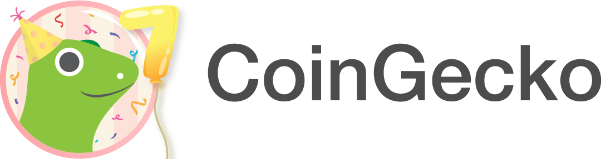

# MyPortfolio

Based on [CryptoApp](https://github.com/zhengxingXue/CryptoApp)

## API

The cryptocurrency data that is used in this app comes from a free API from [CoinGecko](https://www.coingecko.com)! Prices may be slightly delayed.

## Built With 

* [BetterSafariView](https://github.com/stleamist/BetterSafariView) - A better way to present a SFSafariViewController or start a ASWebAuthenticationSession in SwiftUI.

## Screenshots

